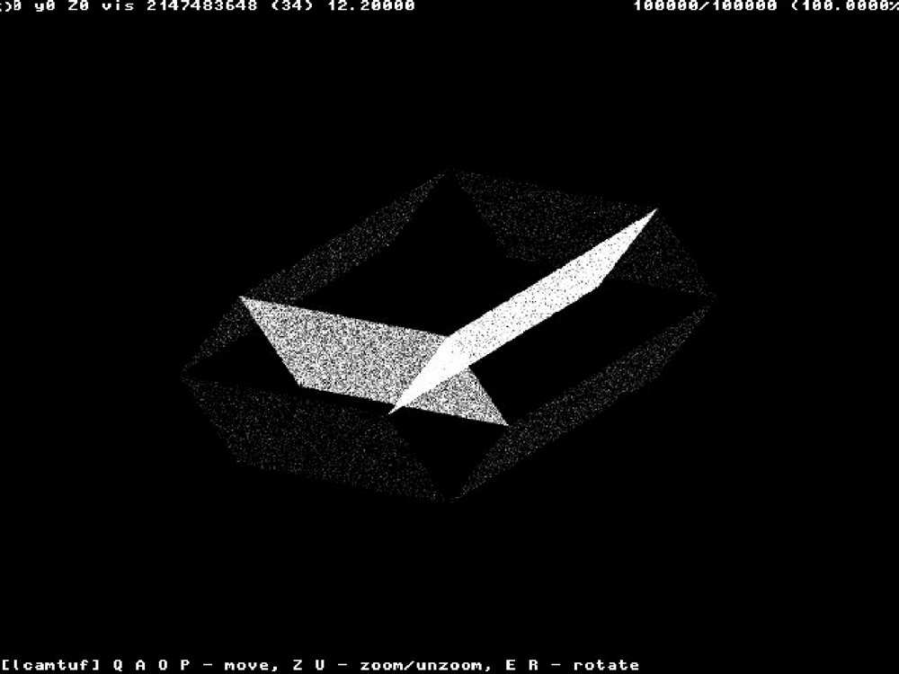
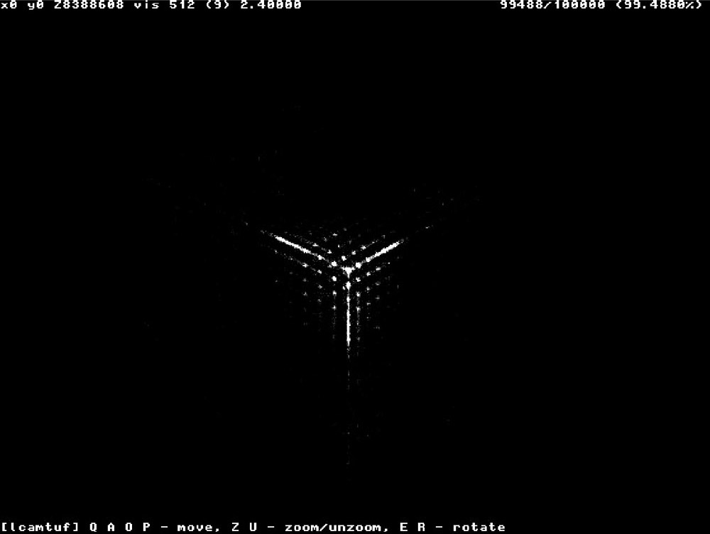
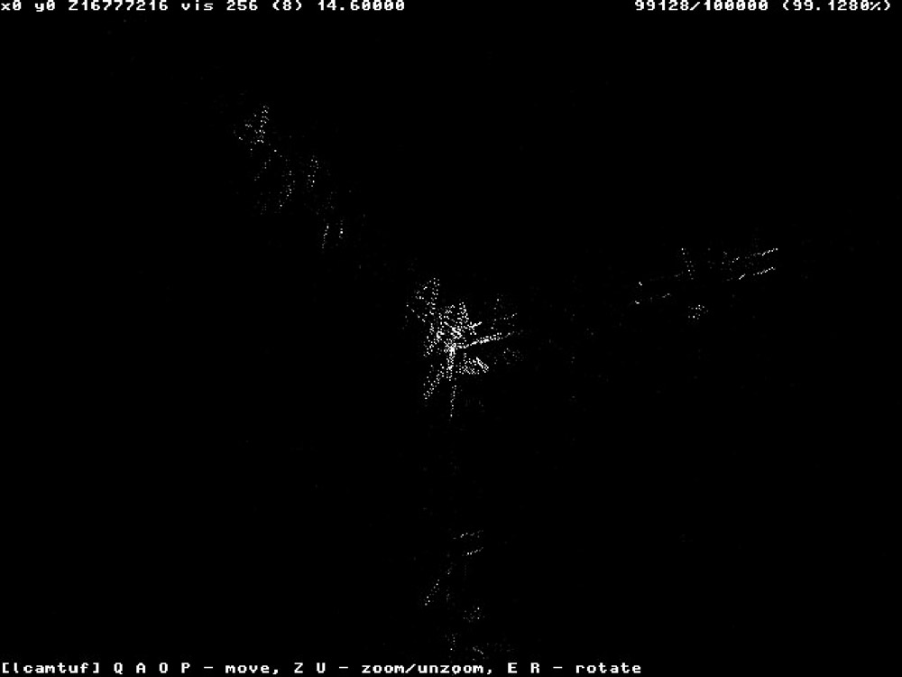
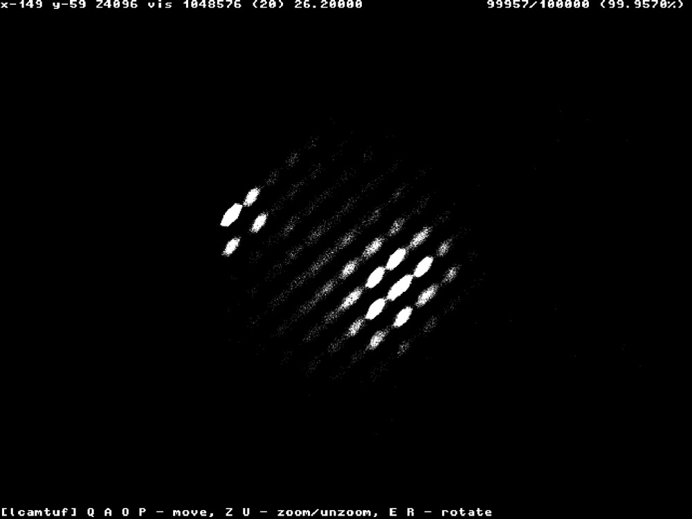
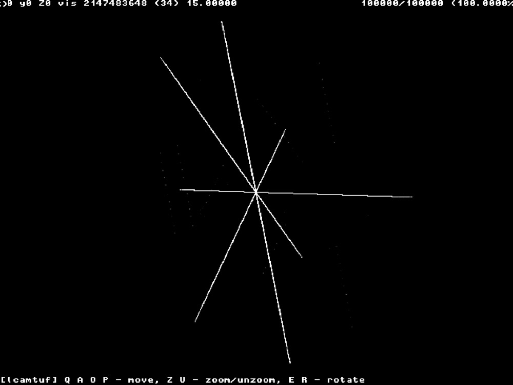
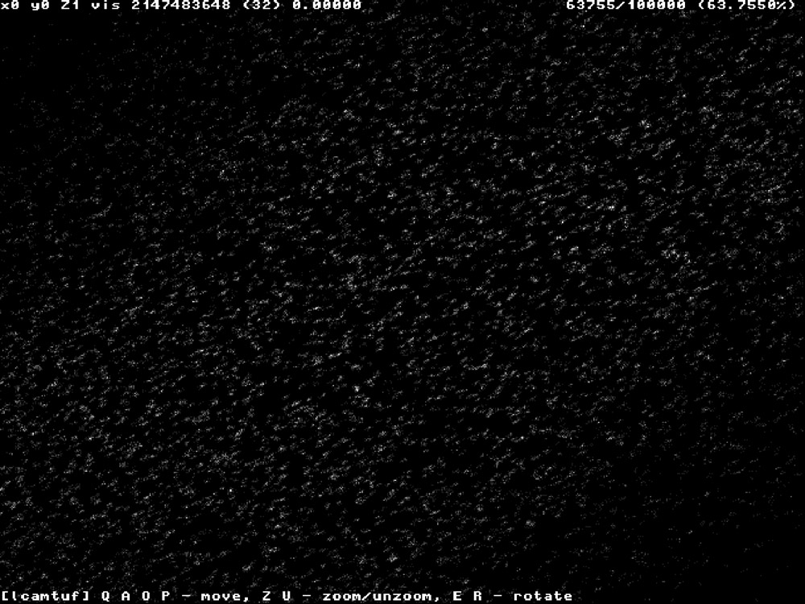
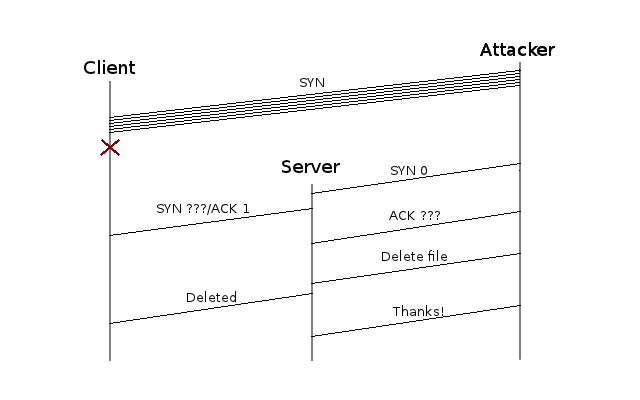

### TCP
. . .

`>` SYN

. . .

`<` SYN/ACK

. . .

`>` ACK

. . .

```
> GET /index.html\r\n
Host: lemonparty.com\r\n
Connection: close\r\n
```


### TCP
. . .

`>` SYN (0)

. . .

`<` SYN(0)/ACK(1)

. . .

`>` ACK(1)


### TCP
. . .

`>` SYN(0)

. . .

[`<` SYN(0)/ACK(1)]{.greyed-out}

. . .

`>` ACK(1)


### TCP
. . .

`>` SYN(39275)

. . .

[`<` SYN(11902)/ACK(39276)]{.greyed-out}

. . .

`>` ACK(?)

### Sequence numbers

```
S0 = 244782
S1 = 245581
S2 = 246380
S3 = 247176
S4 = 247975
S5 = 248771
...
```

### Sequence numbers
Map relationships to cartesian coordinates:

$$
\begin{eqnarray*}
x_t &=& D_t &=& S_t - S_{t-1} \\
y_t &=& D_{t-1} &=& S_{t-1} - S_{t-2} \\
z_t &=& D_{t-2} &=& S_{t-2} - S_{t-3}
\end{eqnarray*}
$$


<footer>
<p>Credit: Silence on the Wire (Michal Zalewski)</p>
<p><a href="http://lcamtuf.coredump.cx/silence.shtml">http://lcamtuf.coredump.cx/silence.shtml</a></p>
</footer>


---

{.hidden-text}

---

{.white-text}

---

{.white-text}

---

{.white-text}

---

{.white-text}

---

{.white-text}

---

{.white-text}

---

{.white-text}

### Attacks
rlogin

IP-based auth

Mitnick's Christmas Day attack

### Attacks

{.hidden-text .maxheight}

### Attacks
ISNProber

Determine if a set of IPs are served by the same host

### Attacks
Active fingerprinting

- QueSO ("Que Sistema Operativo?")
- Xprobe 2
- Nmap

### Attacks
Passive fingerprinting

- Nmap
- Ettercap
- Sscan2kpre625

### Q&A
Any questions?
